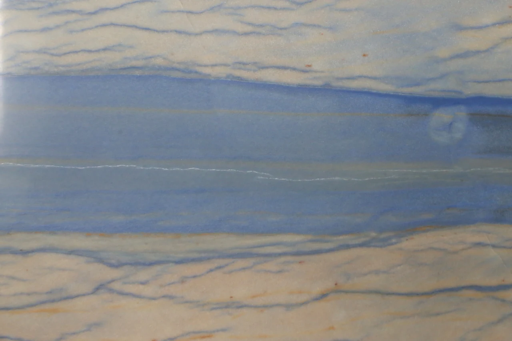

# Codex Learning Lab

Навчальний мінісайт для практичного знайомства з роботою Codex: файли, код, термінал і перевірка результату.

Проєкт створено як навчальну лабораторію для Олександра Шведа (ALTACO / EONYX), щоб пройти повний цикл роботи з Codex на простому прикладі.

---

## Файли проєкту

| Файл | Призначення |
|---|---|
| `index.html` | Основна сторінка сайту — структура всіх блоків |
| `styles.css` | Оформлення: кольори, шрифти, адаптивна сітка, підтримка темної теми |
| `script.js` | Інтерактивність: тема, чекліст, вкладки, картки, збереження стану |
| `README.md` | Цей файл — опис проєкту та запуску |
| `assets/logos/altaco_icon.svg` | Іконка ALTACO — експортована з `icon.ai` (стор. 1), векторний SVG |
| `assets/logos/altaco_logo.svg` | Логотип ALTACO — експортований з `logo.ai` (стор. 3), векторний SVG |
| `icon.ai` | Оригінальний файл іконок ALTACO (Adobe Illustrator, не змінено) |
| `logo.ai` | Оригінальний файл логотипів ALTACO (Adobe Illustrator, не змінено) |

---

## Як відкрити локально

### Варіант 1 — просто відкрити файл
Знайди `index.html` у папці проєкту і відкрий у браузері (подвійний клік або перетягни у вікно браузера).

### Варіант 2 — локальний сервер (рекомендовано)
```bash
python3 -m http.server 8080
```
Потім відкрий у браузері: `http://localhost:8080`

---

## Функціональність сайту

### Блоки сторінки
1. **Hero** — назва, короткий опис, кнопка перемикання теми
2. **Що я тут вивчаю** — картки з темами навчання
3. **Чекліст прогресу** — 5 пунктів із прогрес-баром; стан зберігається між сесіями
4. **Контекст проєкту** — вкладки ALTACO і EONYX із коротким описом кожного напряму
5. **Три кити вебу** — картки HTML / CSS / JavaScript, які розкриваються по кліку
6. **Що має показати Codex** — список навчальних завдань
7. **Footer** — підпис проєкту

### Інтерактивні елементи
- **Перемикач теми** (🌙 / ☀️) — змінює світлу/темну тему; вибір зберігається у `localStorage`
- **Чекліст** — відмічай пункти, що вже зрозумів; прогрес-бар оновлюється; стан зберігається у `localStorage`
- **Вкладки ALTACO / EONYX** — перемикають контент блоку
- **Картки технологій** — клік розкриває/приховує коротке пояснення

### Збереження стану
При перезавантаженні сторінки автоматично відновлюються:
- вибрана тема (світла або темна)
- відмічені пункти чекліста

---

## Контекст

**ALTACO** — українська компанія з дистрибуції натурального каменю та кварцового агломерату (Київ). Представляє бренди Bagnara та Santa Margherita в Україні.

**EONYX** — AI deployment / R&D-проєкт, що створює прикладні AI-системи для B2B-компаній реального сектору. ALTACO є практичним полігоном для тестування AI-рішень.

---

## Бренд-активи

Логотипи ALTACO у папці `assets/logos/` є векторними SVG, експортованими з оригінальних `.ai`-файлів без змін вихідних файлів.

| SVG-файл | Вихідний .ai | Сторінка | Опис |
|---|---|---|---|
| `assets/logos/altaco_icon.svg` | `icon.ai` | 1 | Квадратний логомарк: темний фон, білий знак |
| `assets/logos/altaco_logo.svg` | `logo.ai` | 3 | Горизонтальний логотип, темні вектори |

SVG перевірено: відсутні embedded scripts, зовнішні посилання та vendor metadata. На темній темі логотип автоматично інвертується через CSS `filter: brightness(0) invert(1)`.

---

## Галерея каменю ALTACO

Блок ALTACO містить адаптивну галерею-каталог із 4 матеріалів: Azul Macauba, Arabescatto Classico, Black Tempest, Brown Silk.

### Оптимізовані WebP

Оригінальні JPG (Canon EOS 6D, ~7–8 MB кожен) не змінювались. Для веб-відображення створено оптимізовані WebP у двох розмірах:

| Файл | 640 px | 1280 px | Оригінал |
|---|---|---|---|
| Azul Macauba | `AzulMacauba2-640.webp` (20 KB) | `AzulMacauba2-1280.webp` (64 KB) | `AzulMacauba2.jpg` (6.4 MB) |
| Arabescatto Classico | `ArabescattoClassico-640.webp` (51 KB) | `ArabescattoClassico-1280.webp` (121 KB) | `Arabescatto classico_2.jpg` (7.5 MB) |
| Black Tempest | `BlackTempest2-640.webp` (43 KB) | `BlackTempest2-1280.webp` (137 KB) | `BlackTempest2.jpg` (7.8 MB) |
| Brown Silk | `BrownSilk-640.webp` (60 KB) | `BrownSilk-1280.webp` (190 KB) | `BrownSilk.jpg` (7.7 MB) |

Усі WebP збережено у `assets/stones/`. Економія ваги: **−98–99%** порівняно з оригіналами.

### Адаптивна верстка

Галерея використовує `<picture>` + `srcset` для вибору оптимального розміру браузером:

```html
<picture>
  <source
    srcset="assets/stones/AzulMacauba2-640.webp 640w,
            assets/stones/AzulMacauba2-1280.webp 1280w"
    sizes="(max-width: 600px) calc(100vw - 40px), calc(50% - 28px)"
    type="image/webp" />
  
</picture>
```

- **Desktop (> 600 px)**: 2 колонки (`grid-template-columns: 1fr 1fr`)
- **Mobile (≤ 600 px)**: 1 колонка
- Пропорції: 3:2, `object-fit: cover`
- `loading="lazy"` — зображення завантажуються лише при прокрутці до блоку
